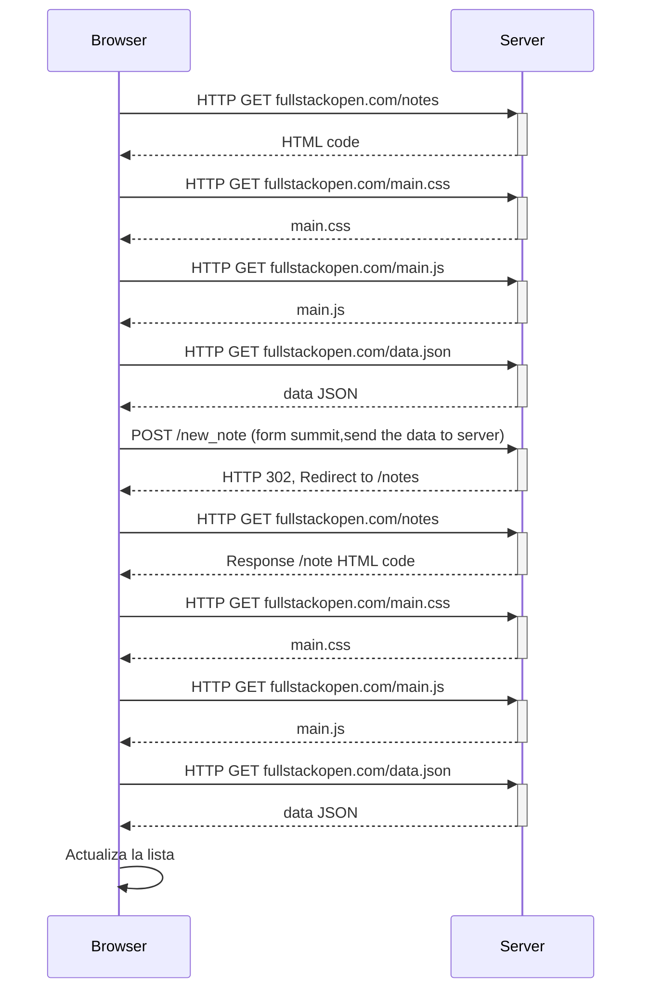

0.4: Nuevo diagrama de nota.

En el capítulo Cargando una página que contiene JavaScript - revisión la cadena de eventos causada al abrir la página https://studies.cs.helsinki.fi/exampleapp/notes se representa como un diagrama de secuencia

https://fullstackopen.com/es/part0/fundamentos_de_las_aplicaciones_web#ejercicios-0-1-0-6